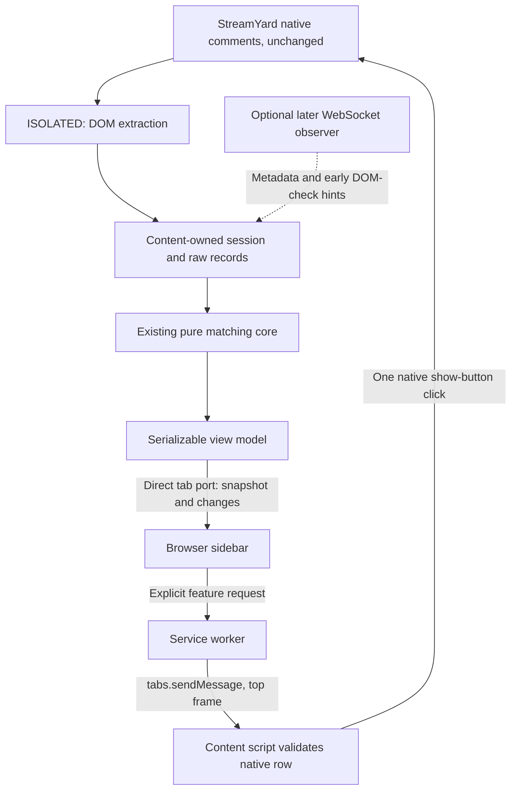

# Ṣafwa v2 — Final Architecture (GPT-6-Astra)

## 1. Executive verdict

**Ship a DOM-fed `chrome.sidePanel` sidebar.** The content script owns capture, session matching and the complete observed-comment record; the sidebar renders that state, while a small service worker handles toolbar activation and validated feature requests. WebSocket observation is deferred from the MVP and may later provide optional enrichment, never replace DOM authority in v2. **StreamYard’s native comments panel remains unmodified in every v2 operating and failure mode.**

Confidence is high in this architecture. Release readiness still depends on live proof of capture coverage, avatar loading and native featuring.

This decision follows the [binding directive](</Users/wasimjalali/Desktop/Personal Project/safwa/specs/counsel/USER-DIRECTIVE-2026-09-11.md>) over conflicting council recommendations. No files were modified. The current `npm test` passes: **86 core tests and all six browser regression harnesses**.

## 2. Verdict table

| Proposal or component | Decision | Resolution |
|---|---|---|
| A. WebSocket capture as the custom feed | Reject | No transport evidence exists, and transport visibility is not proven equivalent to native visibility. |
| B. DOM observer plus custom panel | Adopt | Shipping architecture, using the required browser sidebar. |
| C. WebSocket primary with DOM fallback | Adapt | DOM remains authoritative. A later socket observer may enrich already established records and accelerate DOM checks. |
| D. Further in-place polish | Reject as v2 | Retain the existing implementation for legacy regression testing, not as the v2 experience. |
| Injected in-page panel | Reject | Conflicts with the directive. |
| `chrome.sidePanel` | Adopt | Sole v2 host. Equivalent browser extension sidebars require a separately tested adapter. |
| Separate popup window | Reject for v2 | Adds window management without resolving capture or featuring limitations. |
| Service worker | Adopt, narrowly | Toolbar activation and validated action routing. No matching state, capture or LLM work. |
| Offscreen document | Reject | No required responsibility. |
| Declarative Net Request | Reject | Ṣafwa does not modify network requests. |
| `storage.local` | Adopt | Existing teacher preferences only. |
| `storage.session` | Reject for MVP | Neither matching state nor a comment database is needed there. |
| `storage.sync` | Reject | No cross-device requirement. |
| Action popup | Adapt | Its five settings move into the sidebar. The v2 toolbar action has no popup. |
| Separate options page | Reject | Settings fit in the sidebar. |
| Generic message bus, storage abstraction or repository reshuffle | Reject | Small explicit contracts are sufficient. |
| WebSocket discovery in the shipping MVP | Reject | Begin with a manual rehearsal inspection. Build an instrument only if that inspection justifies it. |
| Automatic return to native badges | Reject | Would modify the native panel, violating the directive. |

The synthesis’s “back to the v1 look” requirement is resolved as follows:

1. A failed enhanced renderer falls back to a simple, readable, v1-style list **inside the sidebar**.
2. A failed sidebar, content script or capture adapter leaves the teacher using **StreamYard’s untouched native panel**.
3. The old in-place renderer is never an automatic v2 fallback.

The directive’s native-panel guarantee takes precedence over preserving literal v1 badge placement.

## 3. Q1: Capture mechanics, runtime ownership and module layout

### Teacher controls

Use one browser sidebar per window. It follows the active StreamYard tab within that window. This avoids a separate tab picker and prevents comments from different studios sharing a view.

| Teacher action | Exact behavior |
|---|---|
| Click the toolbar icon on StreamYard | Open the sidebar and set the existing master preference to enabled. If already enabled, reopen or focus it. Repeated clicks never turn filtering off. |
| Click the toolbar icon elsewhere | Open the sidebar with `استودیوی StreamYard را باز کنید`. Do not show another tab’s comments or change the master preference. |
| Turn the sidebar master switch off | Show `غیرفعال`, remove the filtered reading view and disable feature requests. Keep the sidebar open so the switch remains accessible. |
| Turn the master switch on | Show the current filtered snapshot immediately. The sidebar is already open. |
| Close the sidebar using browser chrome | Close the view only. Do not reset matching state or change the master preference. |
| Open settings | Replace the sidebar list with the five settings. A back button returns to the same reading position. |
| Reset this broadcast | Reset only the bound tab’s Ṣafwa session, then seed currently mounted native comments. Never clear StreamYard comments. |
| Switch to another StreamYard tab | Disable actions immediately, bind the new tab and request its snapshot. |
| Switch to an unrelated tab | Show the studio prompt. Never leave another studio’s actionable list visible. |

The master switch retains v1’s presentation semantics: DOM capture and session matching stay warm while off. `llmEnabled` remains the separate control for semantic requests. Closing or disabling the view does not erase questions.

The five settings retain their existing storage keys:

| Setting | Existing key field | Sidebar label |
|---|---|---|
| Collapse duplicates | `collapseDuplicates` | `جمع کردن سوال‌های تکراری` |
| Fold confirmed extras | `hideExtras` | `جمع کردن سوال دوم هر نفر` |
| Join continuations | `joinContinuations` | `وصل کردن ادامهٔ سوال` |
| Fold greetings | `hideGreetings` | `جمع کردن سلام و دعا` |
| Semantic classification | `llmEnabled` | `فهمیدن معنی یکسان` |

All application labels, accessibility names, status messages and platform display names belong in `CONFIG.LABELS`. The brief’s references to “four toggles” are superseded by the directive and the five settings already implemented in `popup/popup.js`.

There is no automatic sidebar opening on installation, browser startup or a background settings event. Chrome requires a user action for `sidePanel.open()`. In the toolbar handler, invoke `open({windowId: tab.windowId})` **before awaiting storage or messaging**, then complete activation. Set `openPanelOnActionClick: false` because the custom handler owns the exact behavior. Chrome documents the opening API from version 116. [Chrome side-panel API](https://developer.chrome.com/docs/extensions/reference/api/sidePanel)

Remove `action.default_popup` from the v2 manifest. Otherwise `action.onClicked` does not fire. [Chrome action API](https://developer.chrome.com/docs/extensions/reference/api/action)

### Manifest and modules

Shipping manifest changes:

```jsonc
{
  "minimum_chrome_version": "116",
  "background": {
    "service_worker": "src/sw.js",
    "type": "module"
  },
  "side_panel": {
    "default_path": "panel/panel.html"
  },
  "permissions": ["storage", "activeTab", "sidePanel"]

  // Remove action.default_popup.
  // Keep existing host permissions and icons.
  // v2 content.js runs at document_start, top frame, ISOLATED.
  // Remove styles.css from the v2 content-script declaration.
  // No MAIN-world entry in the MVP.
}
```

No additional `tabs`, `scripting`, `debugger`, offscreen or network-interception permission is required. Existing StreamYard host permissions cover matching tab metadata; using the `tabs` namespace does not itself require the broad `tabs` permission. [Chrome tabs permissions](https://developer.chrome.com/docs/extensions/reference/api/tabs)

| File | World | Responsibility |
|---|---|---|
| `src/content.js` | ISOLATED, classic bootstrap | Select the sidebar or explicitly selected legacy build path. Load the v2 session coordinator. |
| `src/session.js`, new | ISOLATED | DOM observation, session ownership, raw records, core invocation, LLM scheduling, native-anchor registry and sidebar subscriptions. |
| `src/dom.js` | ISOLATED | All StreamYard extraction, container/context checks and final native-button validation/clicking. |
| `src/config.js` | Shared configuration | Selectors, labels, settings, flags and budgets. |
| `src/normalize.js`, `src/dedup.js`, `src/grouping.js`, `src/state.js` | Pure ESM | Existing matching behavior. No transport-driven decision changes. |
| `src/panel-model.js`, new | Pure ESM | Project decisions and source records into serializable sidebar rows. |
| `src/protocol.js`, new | Pure ESM | Message types and explicit envelope validation. |
| `src/health.js`, new | Pure ESM | Health transitions with an injected clock. |
| `src/sw.js`, new | Extension service worker | Toolbar activation and privileged action routing. |
| `panel/panel.html`, new | Extension document | Sidebar shell and static failure message. |
| `panel/panel.js`, new | Extension document | Subscription, rendering, scroll position, settings and action requests. |
| `panel/panel.css`, new | Extension document | Ṣafwa sidebar styling only. |
| `src/llm-classifier.js` | ISOLATED | Existing classifier fetch and parsing. No SW relocation. |
| `src/ui.js`, `styles.css`, `popup/*` | Legacy path | Retained for v1 regression coverage. Never invoked or injected by the production v2 path. |

There is no new backend, authentication flow, WebAssembly module or remote executable code.

### Data flow



Only a teacher-initiated, validated feature request invokes a native control. Capture and rendering do not insert badges, change classes, write diagnostic attributes, scroll, hide elements or alter native layout.

This requires removing v2 calls to `wireEnabledToggle()`, `ui.render()`, `ui.revealOrphanedDuplicates()` and the `data-safwa-*` writes currently present in [src/content.js](</Users/wasimjalali/Desktop/Personal Project/safwa/src/content.js:82>). Those remain available only in the explicit legacy path.

### Session ownership

**All matching state lives in the isolated content-script realm.** It does not live in the sidebar, SW or Chrome storage.

The content-owned session contains:

- `documentToken`: random identifier for this content-script lifetime.
- `sessionEpoch`: changes on reset or a studio-context change.
- `settingsRevision`.
- An immutable record of each admitted comment occurrence.
- The existing `createState()` matching state and current decisions.
- Logical-row membership and representative source IDs.
- Native anchors, held separately from comment data.
- Applied LLM results, pending request identities and action-result receipts.
- A monotonically increasing publication revision.

An admitted record has a generated `sourceId`, arrival sequence, original handle, platform, text, avatar metadata and arrival timestamp. Pass a separate plain copy into `processComment()`, because it mutates its input.

**Do not pass `el` or `cardEl` into the v2 matching core.** Store native references in the anchor registry. This prevents historical signatures and fragments from retaining detached native nodes. The current core is pure in its dependencies, but its browser-supplied comment objects can retain DOM references through `firstComment` and `fragments`. See [src/dedup.js](</Users/wasimjalali/Desktop/Personal Project/safwa/src/dedup.js>) and [src/grouping.js](</Users/wasimjalali/Desktop/Personal Project/safwa/src/grouping.js:135>).

| Event | State behavior |
|---|---|
| Native comments container replaced on the same studio route | Preserve raw records, decisions, counts and matching state. Invalidate native anchors and reattach observation. |
| Sidebar closed, reopened or reloaded | Preserve content-owned state. Rehydrate the view. |
| SW terminated or restarted | Preserve content-owned state. Subsequent action messages wake the SW. |
| Teacher settings changed | Invalidate pending LLM work and rebuild from the complete admitted record, not merely mounted native rows. Publish atomically. |
| Session reset | Start a new epoch and matching state. Seed currently mounted native rows. |
| Studio route changes | Start a separate session. Never carry one-person state into another studio. |
| Hard navigation, tab discard or page crash | Content-owned memory is lost. Mark the old view disconnected and begin a new session when capture returns. No claim of historical recovery. |

For the MVP, the conservative studio boundary is the current origin and pathname, kept only in memory. Query/hash changes are not session boundaries unless discovery proves otherwise. Route behavior must be tested before release.

The current container watchdog explicitly creates fresh state and clears maps at [src/content.js:349](</Users/wasimjalali/Desktop/Personal Project/safwa/src/content.js:349>). Copying that behavior into v2 would discard off-screen sidebar history. It must be replaced in the sidebar path.

### DOM admission and identity

Keep the existing extraction vocabulary and 80 ms batching target, with these changes:

1. Start discovery at `document_start`. Attach to the verified container even while it is empty.
2. Capture immutable candidate values in observer callbacks. Do not queue only mutable `li` references for later extraction.
3. Settle partially populated or recycled rows before admitting them. An author from one row version must never be paired with another version’s text or avatar.
4. Coalesce repeated observations of the same row version. An 80 ms scheduled flush is a maximum wait, not a debounce continually postponed by incoming traffic.
5. Keep one cheap container-liveness check every second. An observed detachment can trigger earlier reattachment.
6. Use monotonic local arrival time for matching windows. Preserve server timestamps, if later available, as metadata only.

Maintain three different identifiers:

- **`sourceId`**: one locally established comment occurrence.
- **Exact native fingerprint**: platform, raw extracted handle and exact displayed text.
- **Matching key**: the existing normalized value used by the core.

They are not interchangeable.

A stable native comment ID, if discovered, can establish occurrence identity across remounts. Without one:

- Two simultaneously observed identical comments are separate occurrences.
- An unambiguous reappearance reuses the previous record and does not increment its count.
- An indistinguishable remount versus identical resend is an identity uncertainty. Preserve the question, avoid speculative count inflation and disable proxy actions that require an unproven occurrence mapping.

A fingerprint cannot solve an observationally indistinguishable identity problem.

### Sidebar synchronization

Use a **direct `chrome.tabs.connect(tabId, {frameId: 0})` port** for content-to-sidebar state. This keeps ordinary reading updates independent of SW lifetime. Feature requests still follow the required SW route.

Common envelope:

```text
{
  v: 2,
  type,
  documentToken,
  sessionEpoch,
  settingsRevision,
  revision,
  requestId?,
  payload
}
```

| Message | Direction | Meaning |
|---|---|---|
| `SUBSCRIBE` | Sidebar → content port | Request the current session and a snapshot. |
| `SNAPSHOT_BEGIN / CHUNK / END` | Content → sidebar | One complete view at revision R. Include expected record count. |
| `PATCH` | Content → sidebar | `baseRevision`, new revision and complete upserts/removals of view rows. |
| `HEALTH` | Content → sidebar | Observer status, publication revision and pending-work count. Sent every 2 seconds while subscribed. |
| `RESYNC` | Sidebar → content | Request another snapshot after a gap or invalid envelope. |
| `FEATURE_REQUEST` | Sidebar → SW → content | One bounded, teacher-initiated native action. |
| `FEATURE_RESULT / ACTION_STATUS` | Content → SW → sidebar | Explicit dispatch, refusal or unknown-outcome response. |
| `RESET_SESSION` | Sidebar → SW → content | Reset the bound session after validating its identity. |

The sidebar stages snapshot chunks and replaces its model only after `SNAPSHOT_END` validates. It ignores old revisions. A revision gap triggers resynchronization rather than applying changes to an unknown base.

Chrome extension messages use JSON serialization. Send plain objects and arrays, never Maps, DOM references or decision-object graphs. [Chrome messaging](https://developer.chrome.com/docs/extensions/develop/concepts/messaging)

The SW registers listeners synchronously at module evaluation. It reconstructs request context from the sender, current tab and content response; no SW-global value is required for correctness. Use `return true` plus `sendResponse` for asynchronous handlers compatible with the declared minimum Chrome version.

Chrome normally terminates idle SWs and discards their globals. An open port alone is not a persistence guarantee. No keepalive alarm or offscreen workaround is permitted here. [Chrome service-worker lifecycle](https://developer.chrome.com/docs/extensions/develop/concepts/service-workers/lifecycle)

### LLM behavior

Keep the existing pipeline and `applyLlmOverride()` as the only decision authorities.

Replace the native-node liveness condition in the v2 LLM callback with:

```text
same documentToken
and same sessionEpoch
and same settingsRevision
and same sourceId/content revision
and request not previously applied
```

Native virtualization must not invalidate a legitimate result for a still-existing sidebar record. Reset, changed content and changed classification context must invalidate it.

Apply `alsoRender` updates in the same publication transaction. Never reconstruct their meaning independently in the renderer.

On settings replay, reuse an LLM result only if its full request context still matches. Otherwise retain the conservative regex result. Do not send a historical burst of replacement requests.

## 4. Q2: Schema discovery and fixtures

**Unknown:** whether StreamYard comments use a page-owned WebSocket, which endpoint carries them, which schema it uses and whether transport events represent the same visibility rules as the native list.

Claims that the socket is definitely pre-moderation, or definitely contains IDs and deletes, are not established by this repository.

### Discovery sequence

1. **Before writing a hook**, inspect Network → WS and Fetch/XHR in a disposable rehearsal studio using Aside.
2. Post uniquely marked synthetic comments and correlate them with native DOM appearances.
3. Identify connection initiator, framing, inbound comment events and unrelated traffic.
4. Exercise identical resends, multiple available platforms, native feature/star, deletion/moderation, comments-tab switching and a short network interruption.
5. Determine whether IDs survive reconnects and whether different identical comments receive distinct IDs.
6. Measure socket-to-DOM timing. Record whether socket-only events ever remain absent from the native list.
7. Only if a useful, bounded, page-owned text transport exists, build the development observer.
8. Produce sanitized fixtures and parser tests before enabling any enrichment.

If comments use a Worker-owned connection, an unsupported binary protocol or another transport, **stop the WebSocket workstream**. Do not expand into Worker interception, protobuf reverse engineering or a second client connection.

### Conditional observer mechanics

Later files:

| File | World | Responsibility |
|---|---|---|
| `src/transport/main.js` | MAIN, classic, `document_start` | Constructor-only observer and bounded forwarding. |
| `src/transport/bridge-early.js` | ISOLATED, classic, `document_start` | Early handshake and bounded queue before ESM initialization. |
| `src/transport/parser.js` | Pure ESM | Fixture-backed decoding and schema validation. |
| Existing `src/health.js` | Pure ESM | Enrichment eligibility and one-way demotion. |

Use static manifest registration. Do not add `scripting` or use script-tag injection.

The observer:

- Uses a `Proxy` around the native constructor and `Reflect.construct`.
- Returns the real native socket.
- Adds its own passive instance listeners.
- Does not wrap `send`, `onmessage`, global `addEventListener` or WebSocket prototype methods.
- Does not open, reconnect, close or send through sockets.
- Does not catch or replace the page’s own handler exceptions.
- If listener setup fails after construction, returns that same socket. It must never construct a second one as a retry.
- Does not disguise itself through fake native `toString()` output.
- Observes future matching sockets and reconnects. It cannot recover sockets already created or sockets in Workers.
- On patch replacement, demotes. It does not fight the page by reinstalling.

Constructor callbacks only check eligibility and enqueue bounded data. Parsing and forwarding occur after the current event dispatch, with the measured overhead budget below.

**Correction to several council answers:** do not claim MAIN execution is categorically page-CSP exempt. Chrome states that the page’s CSP applies in MAIN. Bundle the observer, use no dynamic imports or eval there and validate actual behavior in the target browser. [Chrome content-script CSP](https://developer.chrome.com/docs/extensions/develop/concepts/content-scripts)

### Bridge contract and trust boundary

```text
{
  ns: "safwa:transport",
  v: 1,
  pageToken,
  generation,
  socketId,
  sequence,
  kind: "frame" | "lifecycle" | "health",
  endpointKey,
  receivedAt,
  dataType: "text",
  data
}
```

`endpointKey` is a configured non-sensitive identifier, not a URL containing a room ID or query string.

Validate source window, origin, namespace, version, field types, generation, sequence, size and rate at the isolated boundary.

Limits:

- 64 KiB per frame.
- 200 envelopes per second.
- 1 MiB per second.
- Queue bounded by both 200 envelopes and 1 MiB.
- No truncated payload is passed to a parser.
- Any overflow immediately demotes enrichment.

A page token and `postMessage` namespace do **not** authenticate StreamYard. Any page script can forge bridge messages.

Consequently, a bridge message can never:

- Authorize a click.
- Change preferences.
- Invoke arbitrary extension APIs.
- Create a confirmed question or increment a count.
- Hide or delete an admitted question.

### Parser contract

```text
parseTransportFrame(frame, fixtureBackedSchema)
  -> {
       status: "ok" | "ignored" | "unknown" | "malformed",
       events: NormalizedEvent[],
       reasonCode: string | null
     }
```

Normalized events may describe comments, edits, deletes, moderation, feature/star state, history boundaries and connection lifecycle. They carry explicit nullable IDs, room association, platform, handle, text, avatar URL and source sequence/time.

Rules:

- Accept only event shapes demonstrated by fixtures.
- Known heartbeat/presence frames are `ignored`, not parse failures.
- Unknown event shapes are not guessed from generic `text` or `message` properties.
- Malformed batches are rejected atomically for enrichment.
- Invalid external input returns a diagnostic result.
- An unexpected parser implementation exception is logged and demotes the observer.
- Parser output never directly enters `processComment()`.

### Redaction

Keep raw observations in temporary local memory or a developer-controlled location outside the repository. Do not use `storage.local` as a raw-frame recorder.

Before committing evidence:

- Replace handles, names, user IDs, comment IDs and room IDs with consistent synthetic values.
- Replace comment text with synthetic Dari, including adversarial and continuation cases.
- Rebase timestamps while preserving useful relative order and intervals.
- Remove cookies, auth fields, token-like values and identifying URLs.
- Replace avatar URLs with inert fixture values.
- Preserve field names, types, protocol framing and event relationships.
- Review the sanitized diff manually.

A normalized real question is still potentially identifying. Normalization is not sanitization.

Add avatar DOM evidence under `captures/` and inert transport fixtures under `test/fixtures/transport/`. Runtime code must never import either.

## 5. Q3: Event semantics

**The DOM supplies admitted question occurrences. Optional transport supplies corroborated metadata and early DOM-check hints. There is never a second feeder into the matching core.**

| Event | Detection | Required action | If absent or uncertain |
|---|---|---|---|
| New native comment | Complete, settled DOM extraction | Admit once, invoke the existing core and publish its decision. | Incomplete extraction stays pending; persistent failures become a visible capture fault. |
| Socket comment | Fixture-backed event | Correlate with DOM. Optionally schedule an immediate bounded DOM check. | Keep out of the question list until DOM admission. Never wait for it before publishing a DOM comment. |
| Avatar update | DOM image update or corroborated transport metadata | Update the same source record’s image metadata. | Show the required neutral avatar fallback; keep the comment. |
| Stable ID | Explicit native attribute or proven transport field | Associate only after unambiguous correlation. | A socket-only ID does not establish native-row identity. |
| Native row removal | Mutation/recycling | Invalidate its anchor only. | Never infer deletion or remove history. |
| Delete/moderation | Explicit, proven event or native status | Preserve the record. An independently confirmed native tombstone may mark it withdrawn and disable featuring. | A socket-only report is advisory. It cannot erase or hide text. |
| Edit | Stable identity plus DOM-confirmed content change | Retain previous text, invalidate pending LLM work and replay the record set with the current revision. | Without stable identity, retain the newly observed text as a separate observation. Do not invent edit semantics. |
| Feature state | Verified native state; optional corroborating event | Reflect only observed state. | Show no “on air” claim. A dispatched click is not confirmation. |
| Star state | Verified state | Optional later read-only reflection. | Omit it. Native starring remains available. |
| Reconnect/backfill | Proven lifecycle and history markers | Use only for enrichment reconciliation. No raw socket history enters matching. | Demote enrichment if boundaries or recovery are unknown. |
| Duplicate transport delivery | Proven event identity | Ignore repeated enrichment updates. | Do not use text similarity as delivery identity. |
| Ordering | Local DOM admission sequence | Preserve established arrival order. | Never reorder the queue using an unproven server clock. |
| Platform metadata | Native indicator, lowercased as today | Preserve `platform::foldHandle(handle)` identity. | Keep an explicit unknown platform and refuse uncertain cross-source correlation. Never guess YouTube. |
| Room change | Validated studio context | New session epoch; reject old-session messages and results. | Uncertain context disables actions until rebound. |

Additional resolutions:

- Do not treat a burst rate as proof of backfill.
- Do not seed hidden transport history into matching state.
- Do not prune `state.signatures` to enforce a UI row limit.
- Duplicate counts mean admitted, distinct observed occurrences. They are not a count of network deliveries.
- A group must always retain a readable representative. `entry.duplicates` alone is insufficient for panel identity and avatars because those slim records do not contain all required metadata.

## 6. Q4: Sidebar rows and the feature proxy

### Row presentation

Every displayed source row, including expanded duplicates and filtered items, includes:

1. Avatar.
2. Handle or displayed name.
3. Platform.
4. Complete comment text.
5. Applicable count, joined or second-question annotation.

Use a logical-question list:

- Exact/token-set and LLM-confirmed duplicates fold into a representative.
- Joined fragments appear together in original order.
- Ambiguous extras and partial fuzzies remain readable while classification is pending.
- Confirmed filtered items remain available through one compact `نظرهای جمع‌شده` disclosure.
- A duplicate count expands its source members, preserving each author and avatar.
- No raw record is deleted merely because its main-list row is folded.

The expandable records are a safety requirement. The live report documents a same-person paraphrase classified as an extra. The sidebar must not turn that recoverable v1 ghost into inaccessible data. This architecture does not claim to fix that classifier error. [Live QA report](</Users/wasimjalali/Desktop/Personal Project/safwa/qa-screenshots/live-2026-09-10-cli/REPORT.md>)

### Avatar extraction

Add only in `src/config.js`:

```text
SELECTORS.profileAvatar = 'img[class*="Avatar__Image"]'
SELECTORS.showCommentButton = 'button[data-testid="show-comment-button"]'
```

`src/dom.js` reads the profile image’s `currentSrc` or `src`, separately from the platform icon. The existing capture explicitly distinguishes these images. [DOM evidence](</Users/wasimjalali/Desktop/Personal Project/safwa/captures/streamyard-live-dom.json>)

Avatar handling:

- Accept a validated HTTPS image URL from the established source.
- Reject credentials in URLs and unsupported schemes.
- Use a fixed-size image, `referrerpolicy="no-referrer"` and asynchronous decoding.
- Do not proxy images through the LLM service.
- Never log or persist identifying avatar URLs.
- Failed or absent images render a bundled neutral avatar or initials in the same space.
- Missing images never block comment admission.

The fallback is a failure state, not a substitute for implementing and live-testing real profile images.

### Ṣafwa design

Use the established brand in [styles.css](</Users/wasimjalali/Desktop/Personal Project/safwa/styles.css:29>):

| Role | Value |
|---|---|
| Canvas | `#f7f3ea` |
| Text | `#14221c` |
| Primary action | `#0e6b51` |
| Structural emerald | `#0a3d32` |
| Duplicate count | `#d4b36a` |
| Secondary text | `#4a534e` |

Use bundled Vazirmatn, a light reading surface, restrained dividers and the gold count as the signature element. Keep the existing wordmark and icons. The sidebar’s settings use the same visual language.

Specify:

- `lang="fa-AF"` and RTL layout.
- Comment body around 17 px, with generous Persian-script line height.
- Handles isolated with `<bdi dir="auto">`.
- Existing Western digits by default, honoring `USE_PERSIAN_DIGITS_IN_UI`.
- At least 40 px action targets and visible keyboard focus.
- No text clamping or faded-out question text.
- Fixed avatar geometry to prevent layout shifts.
- No animated arrival stream or count animation.
- Respect reduced motion.
- No subtitles or routine explanatory copy beneath headings.

Append chronologically. Auto-follow only when within 48 px of the list’s end. If the teacher scrolls upward, preserve the reading anchor and show a localized new-items control. LLM regrouping, image loading and count updates must not move the text being read.

### Cross-document feature path

```text
Sidebar trusted click
→ runtime.sendMessage(FEATURE_REQUEST)
→ SW validates sender and target tab
→ tabs.sendMessage(tabId, request, {frameId: 0})
→ content validates session, occurrence and current native row
→ dom.js validates and clicks the native show button
→ explicit result returns through SW
```

Request:

```text
{
  v: 2,
  type: "FEATURE_REQUEST",
  requestId,
  windowId,
  tabId,
  documentToken,
  sessionEpoch,
  sourceId,
  sourceRevision,
  expiresAt
}
```

The sidebar sends an opaque source ID, not a selector, native element, URL or arbitrary text to search and click.

**SW validation**

- Sender belongs to this extension and is the sidebar document.
- Reject content-script or external senders attempting to impersonate the sidebar.
- Target tab belongs to the requesting window and is its active StreamYard tab.
- Request structure and expiry are valid.
- Forward only the defined command.
- Retain no matching state and do not automatically replay an action after restart.

**Content validation immediately before clicking**

1. Validate `documentToken`, `sessionEpoch`, enabled state and request expiry.
2. Resolve the requested source record and verify its revision.
3. Confirm the native container and row are still connected.
4. Resolve through a proven native ID, or a continuously tracked row occurrence.
5. Re-extract platform, exact handle and exact displayed text.
6. Compare them with the intended **source comment**, not merged text or a normalized match key.
7. Reject any ambiguous or recycled binding.
8. Confirm exactly one matching native show button, enabled and belonging to that validated row.
9. Recheck the row version and perform `.click()` in the same synchronous task, with no intervening `await`.

Normalization is appropriate for finding candidates. It is insufficient to authorize an on-air action.

### Identical comments and remounts

The existing `liveByFingerprint` is not a safe final action registry: it maps a fingerprint to one node. Use occurrence-aware anchors and a set of candidate holders.

- Two indistinguishable native candidates: refuse.
- Lost anchor followed by one identical remount, without a stable ID: refuse if occurrence continuity cannot be proved.
- A stable socket ID without a corresponding proven native association: refuse.
- Never choose “first,” “latest” or “either twin is harmless.”

This deliberately sacrifices proxy availability to satisfy **never feature the wrong row**.

### Joined and duplicate groups

The main action targets the explicitly displayed representative.

For a joined question, feature the **original native fragment**. StreamYard’s button cannot broadcast Ṣafwa’s concatenated text. Use the label `نمایش بخش اول` for joined rows so that limitation is visible before the click.

Expanded source members may expose their own validated actions. Never substitute another author’s duplicate silently.

### Virtualized-away fallback

**No scroll hunt, `scrollIntoView`, highlighting, synthetic hover sequence or delayed automatic click.**

When the row is absent or its identity cannot be proved:

- Keep the question readable.
- Disable its feature action.
- Show `برای نمایش، نظر را در ستون اصلی پیدا کنید`.
- Recompute availability when native rows are observed again, but require a fresh teacher click.

The exact interaction cost is:

1. Move attention to the native panel.
2. Manually locate the comment, potentially by scrolling or native search.
3. Use StreamYard’s own feature control.

The lookup time is **not bounded by current evidence**. It may take seconds or fail because the comment is no longer available. “One extra tap,” “near zero cost” and a guaranteed subsecond scroll sweep are rejected claims.

The recorded broadcast must confirm whether `.click()` works without hover or trusted input. That is a release gate, not an assumption.

### Action delivery and acknowledgement

Memoize `requestId` in content-owned session memory before dispatch. Repeated delivery of the same request returns its recorded outcome without another click.

- Request expiry: 2 seconds.
- Sidebar acknowledgement timeout: 1 second.
- Timeout triggers `ACTION_STATUS`, not another click.
- If the outcome remains unknown, show `نمایش را در پخش بررسی کنید`.
- Do not optimistically mark the comment “on air.”
- Never retry a native toggle automatically.

## 7. Q5: Failure model and performance budget

### Failure behavior

These thresholds are initial engineering requirements, not measurements already achieved.

| Failure | Signal and threshold | Response | Teacher sees |
|---|---|---|---|
| Sidebar cannot connect initially | No valid session response within 2 seconds | Keep retrying without clearing source state. | Native-panel guidance. |
| Ordinary SW sleep | SW absent between actions | Direct content/sidebar updates continue; next action wakes SW. | Nothing. |
| SW interrupted during feature request | No result within 1 second | Query result; never redispatch automatically. | Check-broadcast message if outcome is unknown. |
| Sidebar/content port disconnect | Disconnect event | Disable actions immediately; reconnect after 100 ms, 500 ms and 1.5 s, then every 5 s. | Last data marked disconnected. |
| Silent port failure | No health response for 4 seconds | Mark stale and resubscribe. | `اتصال قطع است؛ ستون اصلی را ببینید` |
| Revision gap or invalid snapshot | First occurrence | Reject transaction and request full snapshot. | Existing readable view; actions suspended until synchronized. |
| Native container replaced | Detachment event, otherwise within 1-second watchdog | Preserve session, invalidate anchors, reattach. | Usually no list change; reconnect status if over 2 seconds. |
| Native comments tab unavailable | Confirmed container unavailable | Keep history; stop claiming current capture. | `ستون نظرات StreamYard را باز نگه دارید` |
| Broken author/text selectors | Five nonempty, unextractable row observations within 3 seconds, after settling | Mark capture degraded; keep existing records and native fallback. | Native-panel guidance. |
| Legitimately empty feed | Valid container, no comments | Healthy waiting state. | `در انتظار سوال‌ها` |
| Core or projection exception | First exception | Log clearly; latch filtered projection off and render retained raw records. Continue safe capture. | `حالت ساده` |
| Enhanced renderer exception | First exception | Switch to minimal raw-row renderer. | Readable v1-style sidebar. |
| Whole sidebar document fails | Script/document failure | Static shell guidance if available; native panel already intact. | Native StreamYard workflow. |
| LLM unavailable | Existing 8-second timeout or invalid response | Keep regex decision. After three failures in 60 seconds, pause new calls for 60 seconds. | Ambiguous questions remain readable. |
| Feature anchor invalid | First mismatch, absence or ambiguity | Refuse only that action. | Native-lookup hint. |
| Avatar fails | Image error or invalid URL | Fixed-size placeholder; no retry loop. | Comment with fallback avatar. |
| Sustained processing backlog | Oldest admitted work over 1 second | Suspend enrichment and new LLM work; show raw rows while draining. | Simple view if needed. |
| Resource budget exceeded | Budget below exceeded | Reduce rendering work and enter simple view; never silently evict questions. | Capacity/capture guidance if reliable processing cannot continue. |

A lack of new comments is **not** evidence of failure. Health describes the observer and channel, not an invented guarantee that StreamYard’s upstream delivery is live.

Exceptions at external-data and DOM boundaries are expected fail-open paths. Matching or rendering bugs must be surfaced, not caught with “skip this question and continue” as their only outcome.

### Additional WebSocket demotion rules

When enrichment is eventually allowed:

| Signal | Threshold |
|---|---|
| Hook or bridge handshake missing | 2 seconds |
| Constructor replaced or listener setup fails | First detection |
| Bridge heartbeat missing | 4 seconds |
| Sequence gap, queue overflow or rate/size violation | First occurrence |
| Required field in a recognized comment event invalid | First occurrence |
| Unknown application-event schema | Three consecutive events or five within 30 seconds |
| DOM/transport identity or content contradiction | First contradiction |
| Eligible DOM occurrence lacks the expected correlated transport event | 1.5 seconds |
| Transport comment cannot be correlated to DOM | 1.5 seconds |
| Reconnect without proven room/recovery association | Immediately on reconnect |

Demotion is one-way for the current document. It disables enrichment within the detecting callback, drops unconfirmed metadata and continues the existing DOM-fed sidebar. **No teacher toast or transport-status banner appears.**

The hook removes its listeners and restores the constructor only if the global still points to its own wrapper. It never overwrites a replacement installed by the page.

### Performance targets

| Area | Budget |
|---|---|
| Supported rehearsal load | 5,000 admitted comments over a 3-hour session |
| Sustained stress | 10 new comments/second for 60 seconds |
| Short burst | 25/second for 5 seconds |
| DOM observation to sidebar paint | p95 ≤250 ms; p99 ≤500 ms, excluding LLM and remote image download |
| DOM/core/projection work | Yield after approximately 8 ms per task |
| Extension-caused long tasks | None over 50 ms in the defined load test |
| Change publication | At most 20 batches/second; coalesce repeated row updates |
| Snapshot chunk | At most 128 rows and 256 KiB |
| Sidebar reopen | Complete 5,000-record recovery within 2 seconds |
| Mounted sidebar rows | At most 150 logical rows, with measured variable heights and overscan |
| Retained comment history | No age- or row-count eviction during the session |
| Session JS heap | Target ≤50 MiB after collection at 5,000 records, excluding image/browser caches |
| MAIN observer overhead, later phase | p95 ≤0.2 ms per eligible event |
| LLM scheduler | At most two in flight, 20 queued; requests expire after 8 seconds from admission |

Rendering limits apply to mounted DOM, not stored questions. Older records remain scrollable and recoverable.

If the supported workload cannot meet these targets, fix the bottleneck or revise the declared support envelope before release. Do not “solve” memory growth by removing unanswered questions or exact-match history.

## 8. Q6: MVP, acceptance criteria, tests and rollout

### Smallest winning MVP

Ship only:

1. The browser sidebar, toolbar activation and its five settings.
2. Content-owned session records that survive native container replacement.
3. The unchanged matching core and existing LLM integration with source-record guards.
4. Required avatars, RTL rows, annotations and recoverable folded content.
5. Direct snapshot/change synchronization.
6. Strict feature proxy and honest native-lookup fallback.
7. Simple-view/native failure paths and required verification.

No socket hook, parser or transport capture interface belongs in this MVP.

### Later phases

**Phase 2: Evidence**

Manual transport discovery, sanitized fixtures and an off-by-default development observer. No production behavior change.

**Phase 3: Optional enrichment**

Only demonstrated capabilities: avatar improvement, stable-ID association, early DOM checks and advisory lifecycle information. DOM capture remains active and authoritative.

Defer automatic scroll hunting, star/moderation proxies, “answered” workflow, separate windows and hard-navigation state recovery. None is needed to prove the required sidebar.

### Flags

| Flag | v2 production value | Meaning |
|---|---|---|
| `CONFIG.PANEL_MODE` | `"sidebar"` | Browser sidebar path. |
| Legacy build selection | `"v1-inline"` only in the legacy regression configuration | Preserves existing behavior for testing. Invalid in a production v2 package. |
| `CONFIG.COMMENT_SOURCE` | **`"dom"`** | Sole admitted-comment authority. |
| `CONFIG.WS_MODE` | `"off"` | Later values: `"observe"` for development and `"enrich"` after promotion. |
| `CONFIG.FEATURE_PROXY_ENABLED` | `true` after live proof | Allows the strict, validated proxy. |
| `CONFIG.AUTO_HIDE_ANYTHING_AMBIGUOUS` | **`false`** | Unchanged invariant. |
| Existing teacher flags | Existing preferences | Five settings retain their storage keys and explicit-false behavior. |

`COMMENT_SOURCE: "websocket"` is reserved by the brief but **not implemented as an authority in v2**. Selecting it must warn and resolve to DOM. No evidence automatically flips this default under this decision.

`WS_MODE: "off"` must mean the production package does not register or execute the MAIN hook. Installing a wrapper and merely ignoring its output is not “off.”

### Acceptance criteria

Keep v1 criteria 1–7 from [the existing specification](</Users/wasimjalali/Desktop/Personal Project/safwa/streamyard-question-filter-spec.md:203>):

1. Exact triplicate becomes one question with count 3.
2. The specified near-duplicate/reordering case is detected.
3. Two valid continuation fragments remain one complete question.
4. A separate second question receives the extra-question classification.
5. Different short questions from different handles remain separate.
6. Selector failure leaves the native feed untouched and logs clearly.
7. Native featuring continues to work.

Extend them:

8. Toolbar activation opens the sidebar with no popup detour.
9. Every source-row presentation includes avatar, identity, platform, full text and applicable annotations.
10. The production v2 path performs zero native annotation, layout, scrolling or diagnostic-attribute writes.
11. Every admitted source record remains reachable through a visible row, group expansion or folded-items view.
12. Container replacement, SW termination and sidebar reopening preserve session membership and counts.
13. All five settings work across complete observed history. Reset affects only the bound session.
14. Snapshot replay, duplicate messages and reconnects do not inflate counts.
15. Wrong-tab, wrong-session, expired, recycled and ambiguous feature requests produce zero native clicks.
16. A valid feature request dispatches at most one native click.
17. Joined-question actions disclose that they feature the original fragment.
18. The teacher can complete the native fallback unaided and accepts its measured cost.
19. All failure and performance budgets above pass the declared workload.
20. The sidebar passes long Dari text, mixed-direction handles, keyboard use, image failure and widths of 360–480 px on the teacher’s actual studio display.
21. Disabling or omitting every WebSocket component leaves the sidebar fully functional.
22. Live capture coverage passes against known posted test comments, including native scrolling and comments-tab changes.

Criterion 22 is a release gate. DOM observation cannot guarantee reception of comments StreamYard never materializes in observable DOM.

### Unit and harness plan

Preserve the current core assertions and six legacy harnesses. Where production defaults change, give legacy harnesses an explicit legacy configuration rather than weakening their expectations.

Add tests for:

| Area | Required cases |
|---|---|
| Panel model | Every `STREAMS` fixture; joined membership; source avatars; duplicate counts; pending fuzzies; confirmed extras; `alsoRender`; all settings. |
| Admission | Row hydration, blank placeholders, rapid recycling, simultaneous identical comments, remounts and no count inflation. |
| Session lifecycle | Same-route container replacement, settings replay, reset, new studio, hard-document change. |
| LLM | Source remains valid after native recycling; wrong epoch/content/settings results ignored; results applied once; bounded scheduler. |
| Protocol | Duplicate/out-of-order changes, revision gaps, partial snapshots, reconnect and malformed envelopes. |
| Proxy | Wrong sender/tab/session; folded-key collisions; identical twins; disconnected row; missing/disabled button; recycling immediately before click; duplicate request ID; lost acknowledgement. |
| Native safety | Instrument DOM mutation methods and scroll writes; assert zero v2 writes except an explicitly requested native click. |
| Health | Fake-clock coverage for every threshold and one-way degradation. |
| Renderer | Preserved reading anchor, variable-height rows, fallback renderer, broken avatar and accessible disabled controls. |
| Later transport | Constructor behavior, native exceptions preserved, no send/prototype patching, parser fixtures, forged envelopes, flood, gaps, reconnect and zero double ingestion. |

All new executable tests join `npm test`. This repository currently has no configured TypeScript or lint check to invent.

### Live verification

Use a disposable, unlisted rehearsal. Never introduce first-time fault injection into a teaching broadcast.

**First, resolve the two cheapest blockers:**

- Feature a native row manually, then through a validated isolated-world `.click()`. Confirm the broadcast output, including without hover.
- Post numbered comments while leaving the native list at the live edge, scrolling it upward and switching its tabs. Compare expected comments with admitted records.

Then run one 1–3 hour teacher-operated session covering:

- The five acceptance streams and the known same-person paraphrase failure.
- Actual avatar loading and platform identification.
- At least ten successful, currently available proxy actions.
- Identical rows, recycled rows and an old virtualized-away question.
- Sidebar close/reopen, master toggle and all settings.
- SW termination with DevTools closed afterward.
- Container replacement and two separate studio tabs.
- LLM timeout, malformed reply and offline interval.
- Renderer failure and native fallback.
- Reading-position preservation under arrivals and delayed classifications.

Compare source membership, not simply visible row counts: filtering intentionally changes the number of visible rows.

The known same-person LLM misclassification must remain recoverable in the sidebar and be reported accurately. Moving the renderer does not establish classifier correctness.

### Rollout and rollback

1. Keep v1’s implementation and tests intact behind the legacy build selection.
2. Build and rehearse the DOM-only v2 package. Its native panel is already unmodified.
3. Promote the sidebar default only after the acceptance gates pass.
4. Use the unpacked rehearsal path first, then the project’s unlisted store update process.
5. Add transport instrumentation only in the later development phase.

Runtime rollback:

- Feature failure: refuse the action; use native controls.
- Enrichment failure: silently demote to DOM.
- Filtered-view failure: simple sidebar list.
- Sidebar/capture failure: native panel.
- Teacher emergency action: master off or close the sidebar.

Never automatically refresh a studio, reload the extension or switch to in-page annotations during a broadcast. A package rollback belongs between broadcasts; refresh destroys content-owned session memory.

**Evidence required to promote `WS_MODE` to `"enrich"`:**

- A proven page-owned, allowlisted text transport.
- Sanitized fixture coverage for each capability being enabled.
- Two consecutive full rehearsal sessions, each including reconnect and studio-context changes.
- Zero incorrect associations, native disturbances or count changes attributable to enrichment.
- Zero dropped expected DOM records.
- Successful deliberate demotion with no teacher-visible interruption.
- A measured benefit, such as reliable ID availability, improved avatar coverage or lower DOM-check latency.

Passing these gates enables enrichment. It does not enable WebSocket feed authority.

## 9. Invariant #1 decision record

**Decision: amend conditionally, before the first programmatic transport observer is introduced.**

The DOM-only MVP complies with the current invariant. A manual DevTools inspection needs no amendment. If inspection establishes a useful page-owned comment transport, apply the following wording before adding the development observer.

No amendment is applied by this read-only task.

Exact replacement for invariant #1 in `CLAUDE.md`:

> **1. Do not assume a StreamYard API, webhook or SDK.** Ṣafwa’s admitted comment stream is the page DOM, observed by an isolated content script and MutationObserver. The DOM observer remains active throughout the document session, and `CONFIG.COMMENT_SOURCE` defaults to `"dom"`. After documented discovery and fixture-backed tests, a separately gated observer may read inbound messages from the page’s own WebSocket for optional enrichment and early DOM checks. It must never create a StreamYard connection, send messages, modify frames, replace page handlers or become necessary for capture, matching or recovery. Transport data alone must never admit, hide or delete a question, increment a count or authorize a native action. Unknown schema, loss, overflow, stale association or disagreement disables enrichment for the document session while DOM processing continues. The native comments panel and its controls remain unmodified and available.

Add this sentence to the selector-isolation rule when the parser is introduced:

> Runtime transport schema knowledge lives only in `src/transport/parser.js`; sanitized captures and fixtures are inert evidence and are never imported by runtime code.

For the v2 amendment to the old specification’s Section 2, use:

> Ṣafwa does not assume a supported StreamYard API, webhook or SDK. Its v2 question feed is admitted from the page DOM through a content script and MutationObserver. An evidence-gated observer of the page’s own WebSocket may supply optional enrichment, but it is private implementation detail and never the feed’s authority or a requirement for recovery.

Record the browser sidebar and native-panel prohibition alongside the old Section 10. Do not leave its injected-floating-panel fallback presented as the v2 design.

If discovery finds no suitable socket, leave invariant #1 unchanged and close the transport workstream.

## 10. Risks ranked

| Rank | Risk | Likelihood × impact | Cheapest mitigation |
|---|---|---|---|
| 1 | Native virtualization or tab switching prevents unseen questions reaching the DOM observer | Unknown × critical | Numbered-comment coverage experiment before release. |
| 2 | Proxy features a different occurrence or recycled row | Medium × critical | Continuous occurrence binding, exact revalidation and refusal on ambiguity. |
| 3 | SPA replacement discards session history | Present in v1 × high | Separate session lifetime from container lifetime. |
| 4 | Sidebar makes an LLM misclassification less recoverable | Observed classifier error × high | Retain every source record and provide folded-item access. |
| 5 | Native DOM mutations leak into the v2 path | Existing code behavior × high | Explicit legacy branch, no injected stylesheet and mutation-guard tests. |
| 6 | Stale sidebar acts on the wrong tab or session | Medium × critical | Document/session tokens, active-tab validation and immediate action suspension on rebinding. |
| 7 | Lost acknowledgement causes a second native click | Medium × high | Content-owned request receipts; status lookup instead of action replay. |
| 8 | MAIN observer affects StreamYard execution | Low but unproven × critical | Omit from MVP; constructor-only observer and rehearsal gates later. |
| 9 | Transport schema, room or moderation mismatch produces plausible wrong metadata | Unknown × high | DOM corroboration and first-contradiction demotion. |
| 10 | Captures expose private traffic or identifying URLs | Medium if raw capture is added × high | Minimal scope, no raw persistence and synthetic fixtures. |
| 11 | Session history or retained native nodes grows memory | Medium × high | Plain records, separate weak anchors, windowed rendering and 3-hour soak. |
| 12 | Sidebar crowds the studio or native lookup is too slow | Unknown × high for usability | Rehearse on the teacher’s actual display and measure fallback attempts. |

## 11. Remaining unknowns and their cheapest discriminating experiments

| Unknown | Cheapest experiment | Decision consequence |
|---|---|---|
| Do new comments still materialize while the native list is scrolled upward? | Post ten numbered comments while holding an older native position. | Failure blocks a claim of complete DOM-only live coverage. |
| Does switching away from Comments stop rendering or unmount the list? | Switch tabs, post three markers, return and inspect admission. | Determines unavailable-state behavior and whether ordinary teacher use passes coverage. |
| Can a sidebar-triggered `.click()` feature without hover or trusted input? | One controlled native click and one proxy click, checked on recorded output. | Blocks proxy release if unsupported. |
| Is the same button a toggle, and how is “already featured” represented? | Capture native state before and after showing one comment. | Defines safe show-only validation and any later state reflection. |
| Is there a stable native comment ID? | Inspect inert attributes on two identical comments before and after remounting. | Determines how much proxy availability can safely improve. React private properties are not a production dependency. |
| Are author, text and avatar updates atomic enough for reliable admission? | Record a short mutation trace during rapid arrivals and row recycling. | Defines settling behavior; unresolved mixed-row extraction blocks release. |
| Can real avatar URLs load in the extension sidebar? | Display several observed provider images with the intended image policy. | Confirms required real-avatar support and provider restrictions. |
| Does the target Aside build support the intended sidebar lifecycle? | Minimal extension test of action opening, tab switching, closing and reopening. | Confirms browser support. Aside was not running during this review. |
| Does origin/pathname identify a broadcast reliably? | Observe entry, exit and navigation between two rehearsal studios. | Establishes the session boundary without copying room identifiers into repository files. |
| Does a page-owned WebSocket carry eligible comments? | Five-minute Network inspection with a marked comment. | Gates all transport implementation. |
| Are protocol, IDs, room association and reconnect semantics usable? | One marked-comment capture with identical resends and a forced reconnect. | Determines which enrichment capabilities, if any, can be implemented. |
| Do delete, edit, moderation, feature and star events actually exist? | Perform each available action once in the rehearsal and correlate observations. | Unsupported capabilities remain absent or advisory. |
| Does transport include comments the native list intentionally withholds? | Compare a held/hidden test comment in transport and native UI. | Prevents treating socket visibility as native eligibility. |
| Is there a worthwhile latency or metadata benefit? | Compare twenty socket/DOM arrivals and avatar/ID coverage. | No useful benefit means no production observer. |
| Is the virtualized-away fallback acceptable during teaching? | Have the teacher feature recent and older questions during rehearsal. | Poor results block claiming the proxy is operationally sufficient; no guessed scroll automation. |
| Does a 3-hour session meet the memory and rendering budget? | Replay 5,000 records with recycled anchors and delayed LLM results. | Gates production defaults. |

Two limits remain explicit: a DOM observer cannot recover a question that never becomes observable, and an ID-less fingerprint cannot prove which identical occurrence has remounted. The architecture preserves data and refuses uncertain actions within those limits; it does not conceal them behind a “never lose” claim.
tokens used
206.270
